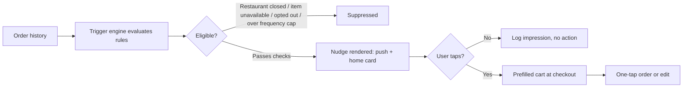

# Reorder Nudge Engine (Swiggy) — PRD

*As of 2026-09-16 · Author: Vaibhav Mehrotra*

## Overview & Problem Statement

A large share of Swiggy's best possible orders are repeats: the same user ordering the same dish from the same restaurant on a predictable occasion (a weeknight dinner, a rainy evening, a payday splurge, a standing Friday order). Today the app treats every session as a fresh discovery journey — the user has to re-search, re-browse, and rebuild a cart even when the outcome is a foregone conclusion. That re-browsing friction is pure downside: it adds time-to-order, creates room to abandon, and pushes some habitual orders into "I'll just cook tonight."

Order history already contains the signal needed to detect these moments. This project builds a rule-based **reorder nudge** that recognizes a habitual or contextually-likely reorder moment and offers a one-tap path back to that order, instead of requiring the user to rediscover it themselves.

**Why now:** order frequency (orders per active user) is the single highest-leverage input to marketplace revenue after acquisition, and repeat behavior is the cheapest frequency lever available — it requires no new supply, no discounting, and no discovery/ranking overhaul.

## Goals & Success Metrics

**North Star:** Orders per Active User per Month (OAU/mo).

**Supporting metrics tree:**

| Layer | Metric | What it tells us |
| --- | --- | --- |
| Delivery | Nudge send volume, send success rate | Is the trigger engine actually reaching eligible users |
| Engagement | Nudge open / click-through rate | Is the moment and message right |
| Conversion | Nudge-to-order conversion rate | Does the nudge turn into an order |
| Impact | Incremental orders per user (treatment − holdout) | The only number that proves this isn't just relabeling orders that would've happened anyway |
| Habit | Time-to-next-order, repeat-purchase rate by cohort | Is frequency actually shifting, not just one-off |

**Guardrails (must not regress):**

- Push/notification opt-out rate
- Order cancellation and return rate
- Post-order CSAT / rating
- Cannibalization ratio (share of nudged orders that a holdout-equivalent user would have placed anyway)

## Target Users & Non-Goals

**Target for v1:** established users with at least 2 completed orders in the trailing 60 days — enough history for a pattern (day-of-week, cadence, restaurant repeat) to exist.

**Explicitly not v1:**

- First-time or one-and-done orderers (no history to detect a pattern from)
- Instamart / grocery orders (different basket and cadence dynamics, deserves its own trigger logic)
- Anyone who has opted out of promotional/behavioral notifications

## Scope

**In scope (v1):**

- Rule-based triggers only (no ML propensity model)
- Two surfaces: push notification and an in-app home-screen card
- Reorder = exact same cart as the triggering past order
- One-tap path from nudge to checkout, editable before payment
- Per-user frequency cap and eligibility checks (restaurant open, item available, address serviceable)

**Out of scope (v1):**

- Dynamic discounting or personalized pricing on the nudge
- ML-based propensity scoring or ranking of which trigger to fire
- Cross-sell or upsell recommendations inside the nudge flow
- Multi-item cart editing within the nudge itself (user can still edit after landing on checkout)

## User Flow & Trigger Logic

**Trigger types (v1, rule-based):**

1. **Day-of-week pattern** — ordered from restaurant X on the same weekday in 3 of the last 4 occurrences.
2. **Cadence deviation** — user's typical gap between orders is N days; it's now been N+2 days with no order.
3. **Contextual** — evening hours + rain/weather signal + a history of ordering "comfort food" categories in similar conditions.

Eligibility checks run at fire-time, not just at evaluation-time, so a restaurant that closed between trigger evaluation and send doesn't get nudged.

## Functional Requirements

1. Trigger engine reads order-history data and evaluates the v1 rule set on a scheduled batch job (e.g. nightly), tagging eligible (user, restaurant, order) triples.
2. Frequency cap enforced per user (max N nudges/week) so no user is spammed by multiple triggers firing at once.
3. Fire-time eligibility check: restaurant open, item(s) available, delivery address still serviceable.
4. Nudge delivered on two surfaces: push notification and a home-screen card; both link to the same prefilled checkout.
5. One-tap reorder prefills the exact cart from the triggering order; user can still edit quantities/items before paying.
6. Every stage emits an event (trigger_evaluated, nudge_sent, nudge_opened, reorder_placed, nudge_dismissed) — see Data Strategy below for the schema.
7. Each eligible user is randomly assigned to treatment or holdout at first eligibility and kept there for the test duration (holdout users are evaluated identically but never sent a nudge).
8. Trigger thresholds (cadence tolerance, frequency cap, weekday-match count) are configurable without a redeploy.

## Experiment & Rollout Plan

**Design:** randomize eligible users into treatment (receives nudges) and holdout (evaluated identically, never sent a nudge) at first eligibility. Compare orders-per-user between the two groups over a 4–6 week window — the gap is the true incremental effect, not the raw nudge-to-order conversion rate.

**Why a holdout and not just before/after:** a before/after comparison can't separate "the nudge caused this order" from "this user was going to order anyway and the nudge just got credit." The holdout is the only honest way to answer the cannibalization question.

**Sample size:** set a minimum detectable effect (e.g. +3% incremental orders/user) and compute required sample size from the baseline orders/user variance before launch, rather than eyeballing significance mid-flight.

**Rollout stages:**

| Stage | Audience | Gate to proceed |
| --- | --- | --- |
| Dogfood | Internal users | No crashes, eligibility logic behaves as expected |
| Pilot | 5% of eligible users | Guardrails hold, directionally positive incrementality |
| Expansion | 25% of eligible users | Statistically significant incremental orders/user |
| Full rollout | 100% of eligible users | Sustained lift across 2+ pilot cohorts |

## Risks, Open Questions & Data Strategy

**Risks:**

- Cannibalization — a nudged order the user would have placed anyway shows up as a false win if measured without a holdout (mitigated above).
- Notification fatigue — over-firing erodes trust in all push notifications, not just this feature; the frequency cap and opt-out guardrail exist for this.
- False-positive triggers — nudging toward a closed restaurant or unavailable dish damages trust fast; fire-time eligibility checks exist for this.

**Open questions:**

- Should dormant users (no order in 14+ days) get a discount-backed nudge, since a plain reminder may not be enough to break inactivity?
- Which trigger type should launch first — day-of-week pattern is simplest to validate, contextual (weather) is likely highest-impact but hardest to get data for.

**Data strategy (this is a personal project, not a production build, so there's no real Swiggy data access):**

1. Generate a synthetic order-history dataset: users, restaurants, order timestamps, cart contents, built with realistic distributions — skewed order-frequency (most users order rarely, a tail orders often), day-of-week seasonality, and repeat-restaurant concentration (a small set of "regulars" per user).
2. Calibrate those distributions against public reference datasets rather than guessing: the [Instacart Market Basket Analysis dataset](https://www.kaggle.com/datasets/lakshaymalhotra/instacart-market-basket-analysis) is the closest public analogue for reorder-rate and days-since-prior-order distributions in a recurring-purchase context, and Kaggle food-delivery sets like [Zomato Delivery Operations Analytics](https://www.kaggle.com/datasets/saurabhbadole/zomato-delivery-operations-analytics-dataset) and [Swiggy/Zomato Order Information](https://www.kaggle.com/datasets/cbhavik/swiggyzomato-order-information) are useful for realistic restaurant/cuisine/order-value shapes even though they're not Swiggy's actual logs.
3. Log every synthetic event (trigger_evaluated, nudge_sent, nudge_opened, reorder_placed) into the same schema a real instrumentation plan would use, so the pipeline, dashboard, and experiment analysis are all built against realistic structure — only the underlying numbers are simulated.
